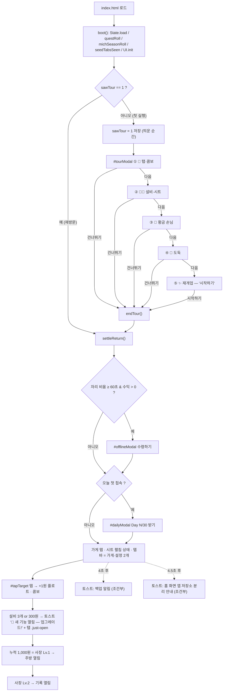
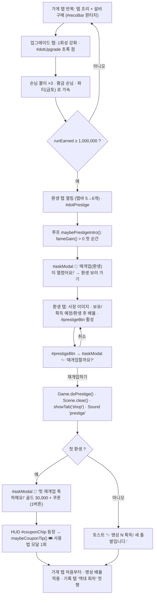
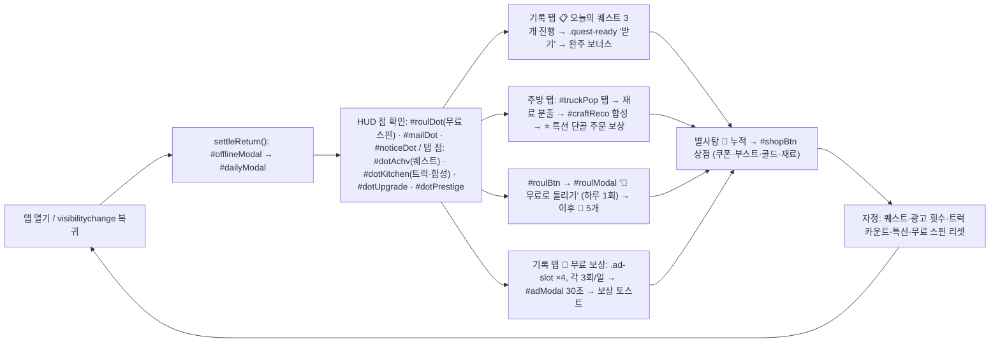
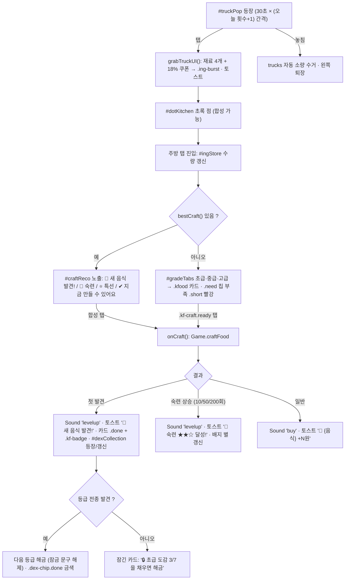
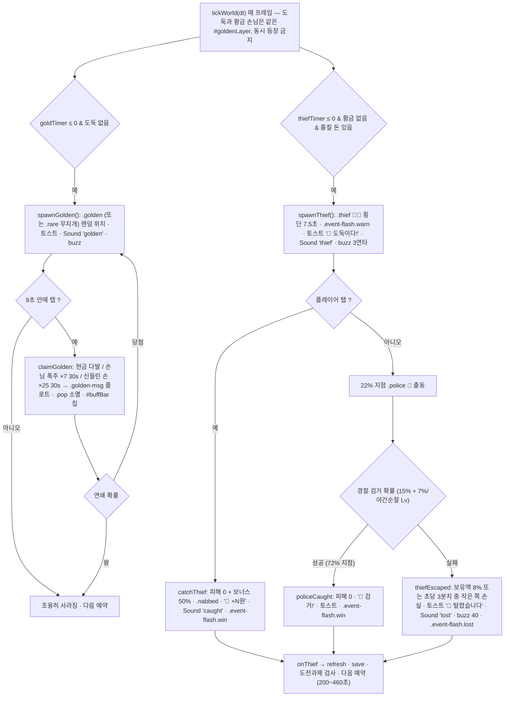

# 분식집 키우기 — 화면 정의서 (IA · 인터랙션 인벤토리)

| 항목 | 값 |
|---|---|
| 작성일 | 2026-09-02 |
| 기준 커밋 | `e3dbac8` |
| 앱 버전 | v1.23.0 (`index.html` 하단 표기) |
| 근거 파일 | `index.html` · `assets/js/ui.js` · `assets/js/main.js` · `assets/js/game.js` · `assets/js/state.js` · `assets/js/data.js` · `assets/css/style.css` |
| 용도 | Figma Make 로 전 화면을 리디자인하는 디자이너용 브리프. 화면·상태·인터랙션의 **현재 상태(as-is)** 를 코드 기준으로 옮긴 것 |
| 기준 뷰포트 | 390×844 (iPhone 14). `#app` 최대 폭 520px. 가로 스크롤 금지 |

> 표기 규칙 — `#id` 는 DOM id, `.class` 는 CSS 클래스, `fn()` 은 `ui.js` / `game.js` 함수. 코드에 없는 판단은 **[가설]** 로 표시했다.
> 이 문서는 새 화면을 제안하지 않는다. 존재하는 화면만 정리한다.

---

## 0. 앱 골격 한 장 요약

```
┌──────────────────────── #app (max 520px, flex column, 100vh) ────────────────────────┐
│ <header id="hud">      상단 재화·아이콘·칩·사장 레벨·(파티 배너)·(버프 바)             │
├──────────────────────────────────────────────────────────────────────────────────────┤
│ <main id="view">       탭 페이지 6개 중 하나만 표시 (.tab-page[data-page])              │
│                        가게 탭만 #view.locked (본문 스크롤 없음, 시트 내부만 스크롤)       │
├──────────────────────────────────────────────────────────────────────────────────────┤
│ <nav id="tabbar">      하단 탭 6개 (fixed, 58px + safe-b)                              │
└──────────────────────────────────────────────────────────────────────────────────────┘
  오버레이(body 직속): .modal ×11 · #powerSave · #goldenLayer · #truckPop · #toast
```

| 레이어 | z-index | 근거 (`style.css`) |
|---|---|---|
| `.float` 플로팅 숫자 (탭존 안) | 5 | `.float` |
| `#tabbar` | 20 | `#tabbar` |
| `#truckPop` 재료 트럭 | 40 | `.truck-pop` |
| `#goldenLayer` 황금 손님·도둑·경찰·이벤트 플래시 | 50 | `#goldenLayer` |
| `.modal` (11개 공통) · `.ing-burst` | 60 | `.modal` `.ing-burst` |
| `#toast` | 70 | `#toast` |
| `#powerSave` 절전 화면 | 200 | `#powerSave` |

갱신 주기 — `main.js` 루프: `Game.tick(dt)` 매 프레임, `UI.refresh()` **100ms** (`UI_MS`), 자동 저장 **10초** (`AUTOSAVE_MS`). `refresh()` 는 현재 탭의 렌더 함수만 부르고, 목록류는 `sig.*` 서명이 바뀔 때만 DOM 을 다시 만든다 (`renderUpgrades` `renderFameShop` `renderMichelin` `renderPartyDex` `renderRanking` `renderQuests` `renderAds` `renderAchievements` `renderKitchen` `renderSpecial` `updateDexCollection` `refreshSaveGuard` `renderOwnerPick` `renderSkins`).

---

## 1. 정보 구조(IA) 트리

```
앱 (#app)
├─ HUD (#hud)  ─ 항상 표시
│  ├─ .hud-top
│  │  ├─ .hud-main   .money-pill(img.coin + #money) · #rate
│  │  └─ .hud-actions  #shopBtn 🛒 · #mailBtn ✉️(#mailDot) · #noticeBtn 📢(#noticeDot) · #roulBtn 🎡(#roulDot)
│  ├─ .hud-sub  칩 4개: #fameChip(#fameNum) · #multChip · #candyChip(#candyHud) · #couponChip(hidden 기본)
│  ├─ #bossBar   #bossChip "사장 Lv.N · 칭호" + #bossXpFill
│  ├─ #partyBanner  (금·토 파티 중에만)
│  └─ #buffBar      (활성 버프 있을 때만)
│
├─ 본문 (#view)  ─ 6개 중 1개 표시
│  ├─ 가게       section.tab-page.shop[data-page=shop] #shopPage      ─ 항상 열림
│  ├─ 업그레이드 section[data-page=upgrade]                          ─ 설비 3개 이상 or 누적 300원
│  ├─ 주방       section[data-page=kitchen]                           ─ 사장 Lv.1
│  ├─ 환생       section[data-page=prestige]                          ─ runEarned ≥ 1e6 or 환생 1회
│  ├─ 기록       section[data-page=achv]                              ─ 사장 Lv.2 or 환생 1회
│  └─ 설정       section[data-page=settings]                          ─ 항상 열림
│
├─ 하단 탭바 (#tabbar)  button.tab[data-tab] ×6, 순서: shop · upgrade · kitchen · prestige · achv · settings
│    점(dot): #dotUpgrade · #dotKitchen · #dotPrestige · #dotAchv  (가게·설정은 점 없음)
│
└─ 오버레이 (body 직속)
   ├─ .modal ×11
   │  ├─ #offlineModal   오프라인 정산            (showOffline)
   │  ├─ #dailyModal     출석 보상 + 30일 출석부   (showDaily)
   │  ├─ #tourModal      첫 실행 안내 5장          (showTour)
   │  ├─ #askModal       확인/안내 (confirm 대체)  (ask) — 7가지 용도로 재사용
   │  ├─ #textModal      텍스트 입력/표시 (prompt 대체) (textDialog) — 3가지 용도
   │  ├─ #shopModal      별사탕 상점               (showShop)
   │  ├─ #roulModal      행운의 룰렛               (showRoulette)
   │  ├─ #mailModal      우편함                    (showMail)
   │  ├─ #noticeModal    공지사항                  (showNotices)
   │  ├─ #adModal        광고 시청 30초 시뮬        (openAd)
   │  └─ #michelinModal  스타 셰프 심사 (플레이 #michPlay / 결과 #michResult) (startMichelin)
   ├─ #powerSave       절전 화면 (전체 검정 덮개)
   ├─ #goldenLayer     황금 손님 .golden · 도둑 .thief · 경찰 .police · .golden-msg · .event-flash
   ├─ #truckPop        재료 트럭 팝업 (탭바 위 고정)
   └─ #toast           토스트 1줄, 1.8초
```

> DOM 상 `.modal` 은 **11개**다. `#askModal` 이 환생 확인·첫 환생 축하·환생 안내·쿠폰 팁·데이터 삭제 2단계·도전과제 상세 등으로 재사용되고, `#textModal` 이 세이브 내보내기·불러오기·자랑 문구로 재사용되므로 **논리적 모달 화면**은 20개 남짓이다 (§2.8 표 참고).

### 1.1 탭 잠금 규칙 (`game.js` `unlockedTabs()`)

| 탭 | data-tab | 해금 조건 | 비고 |
|---|---|---|---|
| 가게 | `shop` | 항상 | 기본 탭. `showTab()` 은 미해금 탭 요청 시 `shop` 으로 강제 |
| 업그레이드 | `upgrade` | 설비 총 3개 이상 **or** `totalEarned ≥ 300` | `genTotal()` |
| 주방 | `kitchen` | 사장 Lv ≥ 1 (`bossLevel()`, 누적 매출 1,000원 = Lv.1) | |
| 환생 | `prestige` | `runEarned ≥ PRESTIGE_BASE(1e6)` **or** `prestiges ≥ 1` | |
| 기록 | `achv` | 사장 Lv ≥ 2 **or** `prestiges ≥ 1` | 퀘스트·무료보상·랭킹 |
| 설정 | `settings` | 항상 | |

- 한 번 열린 탭은 `s.tabsSeen` 에 기록되어 다시 잠기지 않는다 (`visibleTabs()` = 열렸거나 본 것).
- 새로 열리는 순간 `renderTabs()` 가 토스트 `🎉 새 기능 열림 — {탭명}!` + `Sound.play('levelup')` + 탭 버튼에 `.just-open` 애니메이션 2.6초.
- 부팅 시 `Game.seedTabsSeen()` 이 이미 열린 탭을 조용히 '봤다'로 적어 기존 유저에겐 연출을 안 띄운다.
- 잠긴 탭은 `b.hidden = true` — **탭바에서 아예 사라진다** (회색 잠금 아이콘이 아님). 따라서 탭바는 2개(첫 실행) → 6개까지 폭이 변한다.

---

## 2. 화면별 정의

### 2.1 HUD (`#hud`) — 상단 고정

| 항목 | 내용 |
|---|---|
| 목적 | 재화·배율·사장 레벨을 항상 보이게. 상점·우편·공지·룰렛 진입점 |
| 진입 조건 | 항상 표시. 절전 모드 중엔 `#powerSave` 가 덮는다 |
| 갱신 | `updateHud()` 100ms. 숫자 `textContent` 직접 갱신 |

구성 요소 (위 → 아래):

| # | 요소 | id / class | 내용 · 상태 |
|---|---|---|---|
| 1 | 매출 알약 | `.money-pill` → `img.coin` + `#money` | `Fmt.won(money)` 예 `12.3만 원`. 23px/800 금색 |
| 2 | 초당 수익 | `#rate` | `초당 {Fmt.rate} 원`. 12px dim |
| 3 | 아이콘 4개 | `.hud-ic` `#shopBtn` `#mailBtn` `#noticeBtn` `#roulBtn` | 33×33 라운드 버튼. 각 `.hud-dot` 빨간 점(9px): `#mailDot`(안 읽은 편지 or 안 받은 선물 `mailHasAlert()`), `#noticeDot`(최신 공지 id > `noticeSeen`), `#roulDot`(오늘 무료 스핀 남음 `roulFree()`). `#shopBtn` 은 점 없음 |
| 4 | 칩: 명성 | `#fameChip` → `img.chip-ic` + `명성 <b id=fameNum>` | 보라 칩 |
| 5 | 칩: 배율 | `#multChip` | `×1.00` (`Fmt.mult(globalMult)`) |
| 6 | 칩: 별사탕 | `#candyChip` → `🍬 <b id=candyHud>` | |
| 7 | 칩: 쿠폰 | `#couponChip` (button) | **쿠폰 0장이면 hidden**. 텍스트 `🎟️ {pct}% · {n}/3 · 1개만`. 켜면 `.armed` 금색 채움. 첫 환생 예외로 3장 초과 시 `(3)+1` 표기 |
| 8 | 사장 레벨 | `#bossBar` → `#bossChip` + `.boss-xp > i#bossXpFill` | `사장 Lv.N · {칭호}`. 칭호: 동네 사장(0~4) · 소문난 사장(5) · 지역 명장(10) · 전국구 사장(15) · 분식 대부(20). XP 바 154×5px `scaleX` |
| 9 | 파티 배너 | `#partyBanner` (button) | 금·토 17:00~24:00 파티 중에만. `🎉 주말 파티 · 모든 수익 ×3 · ⏳ h:mm:ss`. 그라디언트 흐름 애니메이션. 탭 → `showTab('achv')` |
| 10 | 버프 바 | `#buffBar` → `.buff` 칩들 | 활성 버프(손님 몰이·황금 손님 버프 등)만. `{icon} {label} · {n}s`. 초 단위 변경 시만 재렌더 |

인터랙션: 4개 아이콘 탭 → 각 모달. `#couponChip` 탭 → `setCouponArmed` 토글 + 토스트(`🎟️ 다음 ×1 구매 −30%!` / `쿠폰 사용을 껐어요`) + `buzz(8)`. `#partyBanner` 탭 → 기록 탭.

상태 변형 요약: 기본 / 쿠폰 칩 노출 / 쿠폰 armed / 파티 배너 노출 / 버프 바 노출(1~3개) / 각 dot on·off / 절전으로 가려짐. HUD 높이는 배너·버프 유무에 따라 **가변**이다.

---

### 2.2 가게 탭 (`#shopPage`, `data-page="shop"`)

| 항목 | 내용 |
|---|---|
| 목적 | 핵심 루프 — 탭 조리 + 설비 구매. 거리 연출로 성장 체감 |
| 진입 조건 | 항상. 부팅 시 `showTab('shop')`. 첫 환생·데이터 삭제 후에도 여기로 복귀 |
| 스크롤 규칙 | **본문 스크롤 없음** (`#view.locked`). 위 `.shop-top` 고정 높이, 아래 `.sheet-body` 만 스크롤 |
| 갱신 | `updateGenList()` `updateReco()` 100ms 갱신 (행은 `buildGenList()` 1회 생성 후 텍스트만 갱신) |

구성 요소 (위 → 아래):

| # | 요소 | id / class | 내용 · 상태 |
|---|---|---|---|
| 1 | 조리 구간 | `.shop-top` `#shopTop` | 높이 `--top-h` 310px (≥760px 화면 340px). 시트 올리면(`.shop.up`) **118px** 로 접힘 |
| 1a | 탭 존 | `.tap-zone` `#tapZone` | 플로팅 숫자 `.float` 컨테이너 |
| 1b | 조리 버튼 | `.tap-target` `#tapTarget` (role=button, tabindex=0) | 215×215 원(≥760h) / 접힘 시 92×92. 내부 `#tapEmoji`(62→70px, SVG 또는 이모지) · `#tapLabel`(메뉴명, 접힘 시 숨김) · `#tapPower`(`+N 원` / 차단 시 `N초 후 재개` 붉은색). 클래스: `.tier-1`~`.tier-8` (단계별 테두리·글로우 색), `.hit`(70ms), `.blocked`(매크로 휴식), `.steam .s2 .s3` 김 3개. `#tapEmoji.levelup` 단계 상승 팝 |
| 1c | 콤보 | `.combo` `#combo` (hidden 기본) | 우상단 78px. `#comboX` `×1.4` · `#comboN` `COMBO 12` · `.combo-bar > i#comboFill`. 콤보 ≥2 표시, ≥30 `.hot` 금색 |
| 1d | 음식 팝 | `.pops` `#pops` | `Scene.popFood()` 가 튀어나오는 음식 `.pop` 을 만든다 |
| 1e | 거리 | `.street` `#street` (aria-hidden) | `scene.js` 담당. 왼쪽 가게 그림 + 손님 `.walker` 왕래. `.tier3~5` 로 조명 색 변화. 시트 올리면 opacity 0 |
| 2 | 시트 | `.sheet` `#shopSheet` | 위 라운드 18px, 그림자. flex 1 |
| 2a | 시트 손잡이 | `.sheet-handle` `#sheetHandle` (button, aria-expanded) | `.grip`(display:none) · `.sheet-title` "설비 & 직원" · `#sheetHint` "위로 밀어 더 보기" ↔ "아래로 밀어 접기" |
| 2b | 시트 본문 | `.sheet-body` `#sheetBody` | 유일한 스크롤 영역. 아래 패딩에 탭바 높이 포함 |
| 2c | 추천 설비 바 | `.reco-bar` `#recoBar` (button) | `#recoIcon` · `✔ 추천 설비` · `#recoName` · `#recoDesc`(`초당 +N`) · `#recoCost`. `.ready`(초록, 살 수 있음) / `.saving`(회색 72%, 모으는 중). `bestGen()` 없으면 hidden |
| 2d | 손님 몰이 | `.boost-btn` `#boostBtn` | `#boostTitle` `#boostSub`. 3상태: 기본(핑크, `60초 동안 모든 수익 ×3`) / `.cooling`(회색 55%, `준비까지 m:ss`) / `.active`(금색 펄스, `손님 폭주 중! · ×3 · N초 남음`) |
| 2e | 구매 수량 | `.section-head` → `h2` "구매 수량" + `.buy-amt` `#buyAmt` | 세그먼트 4개 `×1 ×10 ×100 최대`, `.active` 보라 채움 |
| 2f | 설비 목록 | `.list` `#genList` (role=list) | `makeItem(buyBtn)` 행 ×10 (`Data.GENERATORS`). **보이는 행 = 마지막 해금 설비 + 1개 미리보기** (`visibleGenCount()`), 나머지 hidden |

설비 행(`.item`) 상태 변형:

| 상태 | 클래스 | 이름 | 설명(`.item-desc`) | 가격 버튼 |
|---|---|---|---|---|
| 잠김(미리보기) | `.locked` (opacity .42) | `???` | `이전 설비를 1개 구매하면 열립니다` | 회색 |
| 구매 가능 | `.buyable` | 설비명 | `g.desc` (0개) / `초당 N원 (전체의 P%)` | 초록 채움 `₩동전 + 금액 + ×amt` |
| 구매 불가(돈 부족) | (없음) | 설비명 | 위와 같음 | 회색 `.no` |
| 저효율 | `.loweff` | 설비명 | `💤 지금 사도 수익이 거의 안 올라요` (금색) | 초록 강조 해제 |
| 수익 한계 | — | 설비명 | `🔝 수익이 한계에 도달해 더 사도 오르지 않아요` | 회색 |
| 보유 수 | `.item-lv` 배지 | — | `N개` (count>0 일 때만) | — |

주요 인터랙션:

| 조작 | 동작 | 피드백 |
|---|---|---|
| `#tapTarget` pointerdown / Space·Enter | `handlers.onTap` → `Game.tap` | `.hit` 70ms · `floatText('+N')` · `Scene.popFood()` · `Sound.play('tap', combo)` (콤보에 따라 음 올라감) · `buzz(6)`. 파티 중 음식 발견 시 토스트 `🎉 파티 음식 발견!` + 플로트 |
| 매크로 차단 | `res.blocked` | `showBlocked()` → 토스트 `🤖 자동 연타가 감지돼 잠시 조리를 멈춥니다` + `Sound.play('blocked')`. 2.5초 도배 방지 |
| 시트 손잡이 드래그 | `bindSheet()` — 위로 28px 이상 = 펼침, 아래 28px 이상 = 접힘, 그 미만 = 토글 | `setSheet()` → `.shop.up` 토글, `sheetUp` 세이브, `buzz(6)`. 접을 때 `sheetBody.scrollTop=0` |
| 시트 본문 스크롤 > 24px | 접힌 상태면 자동 펼침 | |
| `#recoBar` 탭 | `onBuyBest()` | 성공: `Sound.play('buy')` · `buzz(8)` · 토스트 `✔ {설비} 구매!`. 부족: 토스트 `{설비} 까지 조금 더 모아요` |
| `.item-cost` 버튼 탭 (행 몸통은 무반응) | `onBuyGen(id)` | 성공: `buy` 사운드 · `buzz(8)` · 쿠폰 성장 토스트(`🎟️ 쿠폰 할인 35% 로 자랐어요` 등). 실패: 토스트 `돈이 부족합니다` / `아직 잠겨 있습니다` / `🔝 수익이 한계에…` |
| `#buyAmt` 세그먼트 | `buyAmt` 변경 → 즉시 가격 재계산 | 쿠폰 armed 상태에서 ×1 외 선택 시 토스트 `🎟️ 쿠폰은 ×1 구매에만 적용돼요` |
| `#boostBtn` 탭 | `Game.startBoost()` | `Sound.play('boost')` · `buzz(20)` · 토스트 `📣 60초 동안 수익 ×3!`. 쿨다운 중 토스트 `준비까지 N 남았습니다` |

첫 실행 시 `init()` 이 `setSheet(true,false)` 로 **시트를 펼친 채** 시작한다(설비가 안 보이는 문제 방지).

---

### 2.3 업그레이드 탭 (`data-page="upgrade"`)

| 항목 | 내용 |
|---|---|
| 목적 | 1회성 영구 업그레이드 65종 구매 + 도전과제 37종 진행 확인 |
| 진입 조건 | 설비 3개 or 누적 300원. 탭 점 `#dotUpgrade` = `hasAffordableUpgrade()` |
| 스크롤 | `#view` 일반 세로 스크롤 |
| 갱신 | `renderUpgrades()` — 해금 상태 서명 `sig.up` 변경 시만 재생성, 가격·buyable 은 매번. `renderAchievements()` — 달성 수 `sig.achv` 변경 시 재생성, 진행바는 매번 |
| 축소 스타일 | 이 탭만 `[data-page="upgrade"]` 규칙으로 행·아이콘·글자 약 0.87× 축소 |

구성 요소:

| # | 요소 | id / class | 내용 |
|---|---|---|---|
| 1 | 제목 | `h2.section-title` "업그레이드" | |
| 2 | 힌트 | `p.hint#upgradeHint` | `한 번 사면 영구 적용돼요. 잠긴 것(🔒)은 조건을 채우면 열립니다.` / 전부 샀으면 `업그레이드를 모두 구매했어요!` |
| 3 | 업그레이드 목록 | `.list#upgradeList` | `makeItem(buyBtn)`. 산 것은 제외. 해금된 것 위, 잠긴 것 아래 (`Game.allUpgrades()` 순서) |
| 4 | 제목 | "도전과제" + 힌트 `달성할 때마다 모든 수익이 +1% 영구 증가합니다.` | |
| 5 | 도전과제 목록 | `.list#achvList` | 미달성: `makeItem('🔒', static)` 행 `.achv-locked` (아이콘 grayscale, `.qbar` 진행바, 우측 `.achv-prog` `1,538 / 10,000`). 달성: `.achv-folder` 카드 안 `.achv-grid` 의 `.achv-chip`(이모지 정사각 버튼) |

업그레이드 행 상태: `.locked`(desc 앞에 `🔒 {조건} · `) / `.buyable`(초록) / 구매 불가(회색). 잠금 문구 패턴 `upgradeLockText()`: `{설비명} N개 필요` · `조리 N회 필요` · `이번 판 누적 N원 필요`.

인터랙션: `.item-cost` 탭 → `buyUpgrade` → `Sound.play('upgrade')` · `buzz(12)` · 토스트 `{이름} 구매!`(+쿠폰 문구). 잠김 탭 → 토스트 `🔒 {조건}`. `.achv-chip` 탭 → `ask()` 1버튼 모달(이모지·이름·설명·`✔ 달성 완료 · 모든 수익 +1%`).

---

### 2.4 주방 탭 (`data-page="kitchen"`)

| 항목 | 내용 |
|---|---|
| 목적 | 재료 12종을 모아 레시피 20종(초급 7·중급 7·고급 6) 합성 → 목돈 + 도감 영구 배율 |
| 진입 조건 | 사장 Lv.1. 탭 점 `#dotKitchen` = 트럭 도착 **or** 합성 가능한 음식 있음 **or** 단골 주문 보상 대기 (`updateTruck()`) |
| 갱신 | `renderKitchen()` — 그리드는 `sig.kitchen`(등급탭·사장Lv·제작여부/숙련·특선) 변경 시 `buildKitchenGrid()`, 재료 수·버튼 활성은 `updateKitchenGrid()` 매번 |

구성 요소 (위 → 아래):

| # | 요소 | id / class | 내용 · 상태 |
|---|---|---|---|
| 1 | 제목·힌트 | "🌾 재료 창고" + `.hint` | 트럭 설명 문구 |
| 2 | 재료 창고 | `.card.ing-store#ingStore` | `.ing` 칩 12개 (`.ing-ic` 그림 26px + `.ing-n` 수량). flex-wrap |
| 3 | 오늘의 특선 | `button.special-card#specialCard` (hidden 기본) | `.sp-ic` + `오늘의 특선 · {음식}` + `만들 때 목돈 ×N · M번 만들면 단골 보상`. 우측 3상태: `.sp-prog` `단골 주문 2/5` / `.sp-claim` `단골 보상 받기`(금색 알약, 카드 `.ready` 펄스) / `.sp-done` `보상 완료 ✔` |
| 4 | 합성 추천 바 | `button.reco-bar.craft-reco#craftReco` (hidden 기본) | `#craftRecoTag` 4종: `🎉 새 음식 발견!` · `🌟 숙련 별이 오를 차례!` · `⭐ 오늘의 특선` · `✔ 지금 만들 수 있어요`. `#craftRecoName` · `#craftRecoDesc`(`목돈 +N`) · `#craftRecoBtn` "합성" 알약. `bestCraft()` 없으면 hidden |
| 5 | 섹션 헤드 | "🍳 합성 · 레시피 · 도감" + `.grade-tabs#gradeTabs` | 세그먼트 3: `초급 · 중급 · 고급`, `.active` 보라→핑크 그라디언트 |
| 6 | 힌트 | `.hint` | 레시피 해금 설명 |
| 7 | 도감 컬렉션 | `.card.dex-collection#dexCollection` (첫 발견 전 hidden) | `🏅 도감 컬렉션` + `.dex-col-mult` `전체 수익 ×1.25`. 행 2개(발견 / 숙련★★): `.dex-chip` `초 3/7` `중 0/7` `고 0/6` + `.dex-chip.all`(dashed) `🏅 전종` / `👑 전종`. `.done` 금색. 하단 `.dex-col-hint` |
| 8 | 레시피 그리드 | `.kitchen-grid#kitchenGrid` | 세로 1열 `.kfood` 카드 (현재 등급만) |

레시피 카드(`.kfood`) 상태:

| 상태 | 클래스 | 헤더 | 본문 | 버튼 |
|---|---|---|---|---|
| 잠김(레벨) | `.locked` (opacity .6) | `❓` + `??? 미발견` + 등급 배지 | `.kf-lock` `사장 Lv.N 에 레시피 해금 · 재료 M개` | 없음 |
| 잠김(등급 게이트) | `.locked` | 같음 | `🔒 초급 도감 3/7 을 채우면 해금 · 재료 M개` | 없음 |
| 열림·미제작 | — | 그림 + 이름 + `.kf-grade.g1/g2/g3`(`초급 효과 ×1` 초록 / `중급 효과 ×2.5` 파랑 / `고급 효과 ×4` 금색) | `.kf-need`: `.need-total` `🧺 재료 M` + `.need` 칩(`그림 have/need`, 부족 `.short` 빨강) | `.kf-craft` "합성" — `disabled`(갈색) / `.ready`(초록 3D) |
| 제작됨 | `.done` (금 테두리) | + `.kf-badge` `✔ +2%` 또는 `★★☆ +4%` | + `.kf-mastery` `제작 52 · ★★★까지 200` | 같음 |
| 특선 | `.special` | + `.kf-special` `⭐특선` | | `합성 ×N` |

인터랙션 · 피드백:

| 조작 | 동작 | 피드백 |
|---|---|---|
| `.kf-craft` / `#craftReco` 탭 | `onCraft(id)` → `Game.craftFood` | 첫 발견·숙련 상승: `Sound.play('levelup')`, 그 외 `'buy'`. `buzz(12/16)`. 토스트 `🎉 새 음식 발견! {음식} +N원` / `🌟 {음식} 숙련 ★★☆ 달성! +N원` / `🍳 {음식} +N원` / `⭐ …`. 부족: `재료가 부족해요` |
| `#specialCard` 탭 | `onSpecialClaim()` | `Sound.play('reward')` · `buzz(14)` · 토스트 `🧑‍🍳 단골 주문 완료! {음식} +N원` |
| `#gradeTabs` 탭 | `currentGrade` 변경 → 그리드 재생성 | 즉시 |
| `#truckPop` 탭 (전역) | `grabTruckUI()` | `.ing-burst` 재료 아이콘 부채꼴 분출 · `Sound.play('buy')` · `buzz(8/14)` · 토스트 `🚚 재료 +4 (밀가루, 계란)` (+ `🎟️ 할인 쿠폰!`) · 트럭 `.leaving` 왼쪽 퇴장 0.42초 |

재료 트럭(`#truckPop`): 간격 `30초 × (오늘 온 횟수+1)`, 자정 리셋. 탭바 바로 위 고정, 오른쪽에서 진입 애니메이션 + `빵빵!` 말풍선. 안 누르면 시간 초과 시 왼쪽으로 떠남(놓쳐도 소량 자동 수거).

---

### 2.5 환생 탭 (`data-page="prestige"`)

| 항목 | 내용 |
|---|---|
| 목적 | 재개업(환생)으로 명성 획득 + 명성 상점 12종 강화 |
| 진입 조건 | `runEarned ≥ 1e6` or 환생 1회. 탭 점 `#dotPrestige` = `fameGain() > 0 || hasAffordableFame()` |
| 갱신 | `renderPrestige()` 매번(텍스트), `renderFameShop()` 레벨 서명 `sig.fame` 변경 시 재생성 |

구성 요소:

| # | 요소 | id / class | 내용 · 상태 |
|---|---|---|---|
| 1 | 제목 | "재개업 (환생)" | |
| 2 | 환생 카드 | `.card.prestige-card` | |
| 2a | 히어로 | `.prestige-hero` → `.prestige-owner-wrap`(`img#prestigeOwner` + `.owner-stage#ownerStage`) + `.prestige-sign`(`popup_frame.png` + "재개업 환영!") | 사장 이미지 = 성별 × 단계(lv2 새내기 / lv3 요리사 Lv5 / lv4 정장 Lv10 / lv5 분식 대부 Lv20) |
| 2b | 설명 | `.hint` | 돈·설비·업그레이드 사라짐, 명성은 영구 |
| 2c | 스탯 3열 | `.prestige-stat` → `#pFameNow` 보유 명성 · `#pFameGain` 획득 예정(`.hl` 강조) · `#pMultNext` 환생 후 배율 | |
| 2d | 환생 버튼 | `button.btn.big.danger#prestigeBtn` | 활성: `재개업하고 명성 N 받기`. **disabled**: `아직 재개업할 수 없습니다` |
| 2e | 요구 문구 | `.hint.small#prestigeReq` | 불가: `이번 회차에 N원을 더 벌면 재개업할 수 있습니다.` / 가능: `다음 명성까지 N원 남음.` |
| 3 | 제목 | `img.title-ic(gem.png)` "명성 상점" | |
| 4 | 명성 상점 목록 | `.list#fameShopList` | `makeItem(buyBtn)` ×12. `.item-lv` 항상 표시 `Lv.2/5` 또는 `Lv.7 ∞`. 가격 `✨N`. 상태: `.buyable` / 부족 `.no` / **MAX** (`.owned` 보라 테두리, 버튼 텍스트 `MAX`) |

인터랙션: `#prestigeBtn` → `handlers.onPrestige` → `ask()` 확인 모달(`✨ 재개업할까요?` … `재개업하기`) → 승인 시 `Game.doPrestige()` · `Scene.clear()` · `showTab('shop')` · `Sound.play('prestige')`. **첫 환생**이면 추가로 `ask()` 1버튼 축하 모달(`🎊 첫 재개업 축하해요!` 축하 골드 30,000원 + 쿠폰) / 이후엔 토스트 `✨ 명성 N 획득! 새 출발입니다.`. 명성 상점 `.item-cost` → `buyFame` → `Sound.play('upgrade')` · `buzz(12)` · 토스트 `{이름} 강화!` / `명성이 부족합니다` / `이미 최대 레벨입니다`.

---

### 2.6 기록 탭 (`data-page="achv"`)

| 항목 | 내용 |
|---|---|
| 목적 | 일일 콘텐츠(무료 보상·퀘스트) + 경쟁·수집(스타 셰프·파티 도감·랭킹) + 개인 기록(명예의 전당·역대 회차) |
| 진입 조건 | 사장 Lv.2 or 환생 1회. 탭 점 `#dotAchv` = `questClaimable()` (받을 수 있는 퀘스트 있음) — **무료 보상·특선은 점에 반영 안 됨** |
| 갱신 | 섹션마다 서명 (`sig.ad` `sig.quest` `sig.mich` `sig.partydex` `sig.rank`). `renderHallOfFame()` 은 서명 없이 매번 innerHTML |
| 길이 | 세로 스크롤이 가장 긴 탭 — 섹션 7개 |

구성 요소 (위 → 아래):

| # | 섹션 | id / class | 내용 · 상태 |
|---|---|---|---|
| 1 | 무료 보상 | `img.title-ic(giftbox)` "무료 보상" + 힌트 + `.card.ad-card#adCard` | `.ad-slot` 버튼 4개 (보너스 골드 · 수익 2배 · 할인 쿠폰 · 재료 한 아름). `.ad-ic` + `.ad-tx`(이름/설명) + `.ad-left` `▶ 2/3`. 소진 시 `.out`(50%, disabled, `내일 다시`) |
| 2 | 오늘의 퀘스트 | "📋 오늘의 퀘스트" + 힌트 + `.list#questList` | `questRow()` ×3 + 완주 보너스 행 1. 상태: 진행(static, `.qbar` 보라, 우측 `%`) / `.quest-ready`(초록 테두리, 우측 `.quest-get` "받기" 알약, 행 전체 button) / `.quest-taken`(55%, `✔`, `보상을 받았습니다`) |
| 3 | 스타 셰프 도전 | "🌟 스타 셰프 도전" + 힌트 + `.card.michelin-card#michelinCard` | `.mich-season` `🗓️ {시즌} 시즌 · N단계` · `.mich-goal` `별 5개 목표: 제한 25초 안에 조리 160번` · `.mich-card-top`(좌: 이번 시즌 등급 `★★☆☆☆` + `🍴 전국 N위 · 상위 P% · 통산 ★…`, 우: `#michStart` 🌟 도전 · `#michShare` 📣 자랑) · `.mich-board`(`.mb-row` 순위표, `.me` 금색, `.mb-gap` ⋯) · `.mich-hist` 지난 시즌 · `.mcz-prize` (미달: `🏆 별 5개를 채우면 모든 수익 ×1.5` / `.done` `✅ 5성 달성! …영구 적용 중`) |
| 4 | 주말 파티 도감 | "🎉 주말 파티 도감" + `.hint#partyHint` + `.card.party-dex#partyDex` | 힌트 3상태: 파티 중 `🎉 지금 파티 중! …(남은 h:mm:ss)` / 완성 `도감을 다 채웠습니다!` / 대기 `금·토 저녁 5시~자정에 … 다음 파티까지 h:mm:ss`. 카드: `.dex-head` `7 / 12` + `모으면 모든 수익 +7%` · `.dex-grid` 4열 `.dex-cell`(`.got` 금색 그림+이름 / 미획득 `❔ ???` grayscale) |
| 5 | 전국 인기 맛집 | "🍜 전국 인기 맛집" + 힌트(`<b id=rankRegion>`) + `.card.rank-card#rankCard` | `#rankHeads` 2열(`🇰🇷 전국` / `📍 {지역}`; `.rh-rank` 큰 순위 + `.rh-sub`; 지역 3위 내 `.hot`) · `#rankParts` `🏅 종합 점수 N/100` + 막대 3개(💰 수익 · ✨ 환생 · 📖 도감) · `#rankBoard` `.rb-row`(🥇🥈🥉 · 이름 · `🔥 인기`), `.me` 금색 + `내 가게` 배지, `.rb-gap` ⋯ |
| 6 | 명예의 전당 | `img.title-ic(levelup_badge)` "명예의 전당" + `.card.records#recordBox` | `.rec` 행(`.rec-ic` · `.rec-nm` · `.rec-v`) — `Game.records()` 개인 최고 기록 |
| 7 | 역대 회차 | `.section-head`("역대 회차" + `.rank-note#rankNote` `지금 재개업하면 N위`, 3위 내 `.hot`) + `.card.runs#runBoard` | **빈 상태**: `아직 재개업한 적이 없습니다. 첫 재개업을 마치면 이곳에 회차 기록이 쌓입니다.` / 표: `.run-row.run-head`(순위·회차·매출·명성·소요) + 상위 10행, `.top` 3행 강조 |

인터랙션 · 피드백:

| 조작 | 동작 | 피드백 |
|---|---|---|
| `.ad-slot` 탭 | `openAd(id)` → `#adModal` 30초 카운트 | 완료 시 `finishAd()`: `Sound.play('reward')` · `buzz(14)` · 토스트 `🎁 보너스 골드 · N원` / `수익 ×2 · 30분 발동!` / `🎟️ 할인 쿠폰 1장 획득!` / `🚚 재료 N개 획득!`. 쿠폰 가득: `🎟️ 쿠폰이 이미 꽉 찼어요`. 중도 `#adQuit`: 토스트 `광고를 끝까지 봐야 보상을 받아요`. 소진: `오늘은 다 봤어요 — 내일 다시 오세요` |
| `.quest-ready` 행 탭 | `claimQuest` | `Sound.play('reward')` · 토스트 `📋 {퀘스트} 완료 · N원`. 완주: `Sound.play('levelup')` · `🎁 완주 보너스 N원 · 손님 몰이 충전!` |
| `#michStart` 탭 | `startMichelin()` → `#michelinModal` | §2.8 |
| `#michShare` 탭 | `shareMichelin()` — `navigator.share` → 실패 시 클립보드 → 실패 시 `textDialog` | 토스트 `공유했어요! 자랑 고마워요 🙌` / `자랑 문구를 복사했어요!` |
| `.dex-cell` `.rb-row` `.rec` `.run-row` | 정적 (탭 없음) | — |

---

### 2.7 설정 탭 (`data-page="settings"`)

| 항목 | 내용 |
|---|---|
| 목적 | 외형(테마·스킨·사장·소리) · 통계 · 데이터 관리 · 세이브 안전 · 테스트 도구 |
| 진입 조건 | 항상 |
| 갱신 | `renderStats()` 매번 innerHTML(25행). 스킨·테마·소리 행은 1회 생성 후 `.on` 토글. `refreshSaveGuard()` 서명 |

구성 요소 (위 → 아래):

| # | 섹션 | id / class | 내용 · 상태 |
|---|---|---|---|
| 1 | 테마 | "테마" + 힌트 + `.card.skin-card` → `.skin-head`(`색 테마` + `.skin-now#themeNow`) + `.skin-wrap > .skin-row#themeRow` | `.skin` 카드 3개(기본 🌌 · 포장마차 🏮 · 중화풍 🏮). 아이콘 대신 `.theme-sw` 색막대 3개(배경·강조·금색). 선택 `.on` 금 테두리 + `✓` |
| 2 | 스킨: 조리 음식 | `.skin-card` → `#tapSkinNow` · `#tapSkinRow` · `.ladder#tapLadder` | `.skin` ×8 (70px, 가로 스크롤·스냅, 끝 페이드 `.skin-wrap::after`). 래더: `.rung` 8칸(`.done` / `.now` 확대 금 글로우 / 대기 28%) + `.rung-note` `다음 · {메뉴} (탭 수익 N원)` |
| 3 | 스킨: 가게 앞 손님 | `#crowdSkinNow` · `#crowdSkinRow` · `.ladder#crowdLadder` | `.skin` ×7. 래더는 `.grow` 세로 5단계 `.grow-step`(`.done` / `.now` "지금" 배지 / `.wait`), 각 `.gs-face` `.gs-body`(이름+서사) `.gs-when`(`초당 N원`) + `.grow-foot` |
| 4 | 사장님 | `#ownerSexNow` + 힌트 + `.owner-pick#ownerPick` | `.owner-card` ×2 (여자/남자, 78px 이미지, `.on` 강조). 이미지는 현재 사장 단계 반영 |
| 5 | 탭 소리 | "탭 소리" + 힌트 + `.skin-card` → `#tapSoundNow` · `#tapSoundRow` | `.skin` ×6 (96px, `.skin-sub` 설명 추가). 탭하면 `Sound.previewTap` 미리듣기(연타 시 음 상승) |
| 6 | 통계 | "통계" + `.card.stats#statsBox` | `.stat-row` 25행(라벨 dim / 값 tabular). 매크로 방지 꺼짐 시 `자동 연타 차단` 행 제외 |
| 7 | 설정 | `img.title-ic(ui_settings)` "설정" + `.card` | `.btn` 세로 8개: `#muteBtn`(아이콘 `#muteIc` + `#muteTx` 소리 켜짐/꺼짐) · `#notifyBtn`(4상태: `🔔 오프라인 알림 켜기` / `켜짐` / `🔕 알림이 브라우저에서 차단됨` / `🔔 이 기기는 알림을 지원하지 않아요` disabled) · `#powerSaveBtn` · `#helpBtn` 조작 안내 다시 보기 · `#saveBtn` · `#exportBtn` · `#importBtn` · `#resetBtn`(`.danger`, 쓰레기통 아이콘) |
| 8 | 세이브 안전 | `img.title-ic(ui_save)` "세이브 안전" + `.card.save-guard#saveGuard` | `.sg-row` 3개(🛡️ 저장소 보호 여부 3상태 / 💾 백업 경과 `아직 백업한 적 없음`·`오늘 백업함 👍`·`N일 전…` / 📲 홈 화면 앱 여부) + `.sg-note`. `.sg-ok` 초록 · `.sg-warn` 금색 |
| 9 | 테스트 도구 | "🧪 테스트 도구" + 힌트 + `.card` | `.btn` 4개: `#dbgHour` ⏩ 1시간 · `#dbgDay` ⏩⏩ 24시간 · `#dbgMoney` 💰 돈 ×1000 · `#dbgFame` ✨ 명성 +10. **테스트 빌드 전용** — 정식판에서는 제거 예정(주석) |
| 10 | 버전 | `.hint.small.center` `v1.23.0 · 자동 저장 10초 간격` | |

인터랙션 · 피드백: 스킨/테마/소리 카드 탭 → `.on` 이동 · `buzz(12)` · 토스트 `{이름} 적용!` (소리는 `buzz(8)` + 미리듣기). 가로 행은 `enableDragScroll()` 로 마우스 드래그 스크롤 지원. `#helpBtn` → `showTour(0)`. `#powerSaveBtn` → `enterPowerSave()`. `#exportBtn` → `textDialog` 읽기전용(자동 전체선택) + 클립보드 복사 토스트. `#importBtn` → `textDialog` 입력 → `불러왔습니다` / `코드가 올바르지 않습니다`. `#resetBtn` → `ask` danger 2단계 → `데이터를 삭제했습니다` + 가게 탭 복귀. `#saveBtn` → `저장했습니다`. dbg 버튼 → 토스트 결과.

---

### 2.8 모달 · 오버레이 정의

공통 껍데기: `.modal`(fixed inset 0, 어두운 배경 rgba(10,7,20,.78) + blur 4px, padding 24) > `.modal-box`(카드색, radius 20, padding 24/20, max-width 330, 중앙정렬, gap 12, `pop` .25s 스케일 인, 넘치면 상자 내부 스크롤). 기본 구성: `.modal-emoji`(52px) → `h3`(19px) → `p`(14px dim, `<b>` 금색) → 버튼(`.btn.big` 주 + `.btn` 보조, 보조는 `margin-top:-4px`). **배경 탭으로 닫기 없음, ESC 없음** — 반드시 버튼.

| # | 모달 | id / 변형 클래스 | 트리거 | 구성 (위→아래) | 버튼 | 닫힘 후 |
|---|---|---|---|---|---|---|
| M1 | 오프라인 정산 | `#offlineModal` | 부팅·복귀 시 60초 이상 자리 비움 + 수익 > 0 (`settleOffline`) | 😴 · `다녀오셨어요!` · `#offlineText`(가득 찼으면 `.offline-full` 금색 박스 `🔔 오프라인 보상이 가득 찼었어요!` → `자리를 비운 N 동안 <b>N원</b>을 벌었습니다.` → 제값/보너스 구간 · 트럭 N대 · 상한 안내 · 점장 구매 예고) | `#offlineOk` 수령하기 | `Sound.play('reward')` · 트럭 재료 토스트 · 점장 구매 토스트(+`buy`) → 출석 모달로 이어짐 |
| M2 | 출석 보상 | `#dailyModal` | 오프라인 정산 직후, 오늘 첫 접속 (`settleDaily`) | 📅 · `오늘의 출석 보상` · `#dailyText`(`Day N / 30 출석!` · 초당 수익 N분치 · 🍬 별사탕 · 보너스 · `🎉 30일 개근 보상!` · 연속 N일) · `.att-cal#attCal` 30칸 6열(`.done` ✓ 금 / `.today` 강조 / `.ms` 🎁 7·14·21 / `.grand` 👑 30) | `#dailyOk` 받기 | `Sound.play('reward')` |
| M3 | 첫 실행 안내 | `#tourModal` `.tour`(max 340) | 첫 실행(`sawTour=0`) 또는 설정 `#helpBtn` | `#tourEmoji` · `#tourTitle` · `#tourText` · `.tour-dots#tourDots`(5개, 현재 `.on` 금색 18px 알약) | `#tourNext` 다음 → 마지막 장 `시작하기` / `#tourSkip` 건너뛰기(마지막 장 숨김) | 첫 실행이면 `settleReturn()`(오프라인→출석) |
| | 5장 내용 | `TOUR[]` | | ① 🍢 분식집을 물려받았습니다(탭·콤보) ② 🧑‍🍳 설비를 사면 알아서 법니다(시트) ③ 🌟 황금 손님 ④ 🦹 도둑 ⑤ ✨ 재개업 | 다음 시 `Sound.play('buy')` | |
| M4 | 확인/안내 | `#askModal` | `ask(o, onYes)` | `#askEmoji` · `#askTitle` · `#askText`(HTML) | `#askOk`(`.btn.big`, `o.danger` 시 `.danger`) · `#askCancel`(`o.oneButton` 시 hidden) | `onYes` |
| M4-a | 환생 확인 | — | `#prestigeBtn` | ✨ `재개업할까요?` | 재개업하기 / 취소 | |
| M4-b | 첫 환생 축하 | — | 첫 `doPrestige` 직후 | 🎊 `첫 재개업 축하해요!` 골드 30,000 + 쿠폰 N장 | 고마워요! (1버튼) | |
| M4-c | 환생 열림 안내 | — | 루프 `maybePrestigeIntro()` — `fameGain()>0` 처음 되는 순간, 1회 | 🎉 `재개업(환생)이 열렸어요!` | 환생 보러 가기 (1버튼) → `showTab('prestige')` | |
| M4-d | 쿠폰 사용법 | — | `maybeCouponTip()` — 쿠폰 처음 생길 때 1회, 다른 모달 열려 있으면 미룸 | 🎟️ `할인 쿠폰 사용법` | 알겠어요 (1버튼) | |
| M4-e | 데이터 삭제 1 | — | `#resetBtn` | 🗑️ `모든 데이터를 삭제할까요?` | 삭제하기(danger) / 취소 | → M4-f |
| M4-f | 데이터 삭제 2 | — | M4-e 승인 | ⚠️ `되돌릴 수 없습니다` | 네, 삭제합니다(danger) / 취소 | `State.wipe()` |
| M4-g | 도전과제 상세 | — | `.achv-chip` | `{아이콘}` `{이름}` 설명 + `.achv-earned` | 닫기 (1버튼) | |
| M5 | 텍스트 | `#textModal` | `textDialog(o, onOk)` | `#textEmoji` · `#textTitle` · `#textDesc` · `textarea.code-box#textInput`(monospace 12px, 4행) | `#textOk`(onOk 없으면 hidden) · `#textCancel` 닫기 | |
| M5-a | 세이브 코드 | — | `#exportBtn` | 💾 `세이브 코드` readonly, 자동 전체선택 | 닫기 | |
| M5-b | 세이브 불러오기 | — | `#importBtn` | 📥 입력 | 불러오기 / 닫기 | `applyImport` |
| M5-c | 기록 자랑하기 | — | 공유·복사 모두 실패 시 | 📣 readonly | 닫기 | |
| M6 | 별사탕 상점 | `#shopModal` `.notice-box` | `#shopBtn` | 🛒 · `상점` · `.candy-bar` `🍬 별사탕 <b#candyNum>` · `.shop-hint` · `.list.shop-list#shopList`(`makeItem(buyBtn)` ×4: 할인 쿠폰 묶음 8 · 수익 2배 30분 5 · 골드 뭉치 6 · 재료 묶음 4) | `#shopClose` 닫기 | 구매: `Sound.play('buy')` · 토스트 `🎟️ 쿠폰 N장 받았어요` 등. 부족: `별사탕이 부족해요` |
| M7 | 행운의 룰렛 | `#roulModal` `.roul-box`(max 340) | `#roulBtn` | 🎡 · `행운의 룰렛` · `.roul-sub#roulSub`(`🎁 오늘 무료 스핀이 있어요!` / `🍬 별사탕 5개로 돌립니다`) · `.roul-wrap` 240px(`.roul-pointer` ▼ · `.roul-wheel#roulWheel` conic 8칸 `.roul-seg`(아이콘+라벨) · `.roul-hub` 🎡) · `.roul-result#roulResult`(`.jackpot` 금색) | `#roulSpin`(`🎁 무료로 돌리기` / `🍬 5 돌리기`, 스핀 중·불가 disabled) · `#roulClose`(`.ghost`) | 스핀: `buzz(12)` → 3.5초 회전(5바퀴+) → `Sound.play('reward')` · `buzz(30 / [20,40,20])` · 결과 `🎯 … 획득!` / `🎉 대박! …` |
| M8 | 우편함 | `#mailModal` `.notice-box` | `#mailBtn` | ✉️ · `우편함` · `.notice-list#mailList` → `.notice-item.mail-item`(`.notice-head` 제목+날짜 · `.mail-from` `From. 운영팀` · 본문 · 선물: `.mail-reward` `🎁 💰 5,000원 · 🎟️ 쿠폰 1장` + `.btn.mail-claim` 받기 / 받은 뒤 `.mail-done` `✔ 받았어요 — …`) | `#mailClose` 닫기 | 열면 `mailSeen` 갱신 → 점 끔. 받기: `Sound.play('reward')` · 토스트 `🎁 선물을 받았어요! …` |
| M9 | 공지사항 | `#noticeModal` `.notice-box` | `#noticeBtn` | 📢 · `공지사항` · `.notice-list#noticeList` → `.notice-item`(제목·날짜·본문) ×4 | `#noticeClose` 닫기 | 열면 `noticeSeen` 갱신 → 점 끔 |
| M10 | 광고 시청 | `#adModal` `.ad-modal` | `.ad-slot` | `.ad-screen`(검정 #0e1017: `.ad-badge` "광고" · `#adEmoji` 슬롯 아이콘 · `#adCount` 30→0 (34px 금색) · `.ad-bar > i#adBar` 초록 진행 · `#adNote`) | `#adQuit`(`.ghost`) 그만두기 | 0초 도달 → 자동 닫힘 + 보상 토스트 |
| M11 | 스타 셰프 심사 | `#michelinModal` `.michelin-modal` | `#michStart` | **플레이 `#michPlay`**: `.mich-title` `🌟 스타 셰프 심사 중` · `.mich-stars#michStars` `☆☆☆☆☆`(30px 금) · `.mich-bar > i#michBar`(남은 시간) · `.mich-meta`(`#michCount` 26px · `#michNext` `다음 별까지 N번` / `⭐ 만점!` · `#michTime` `25s`) · `button.mich-tap#michTap`(`#michTapEmoji` 40px + `조리!`) · `#michQuit` 그만두기(`.ghost`). **결과 `#michResult`**: `#michResultEmoji`(🏆/🎉/😢) · `.mich-stars.big#michResultStars` · `#michResultText`(`별 N개 · N원 획득!` + `.mich-grand` / `.mich-tierup`) · `#michDone` 받기 · `#michShareResult` 📣 기록 자랑하기 | 탭마다 `Sound.play('tap')` / 별 상승 `levelup` + `buzz(20)` · `.hit` 95%. 종료: 5성 `prestige` 사운드, 그 외 `reward` | `closeMichelinResult()` → 도전과제 검사 |

비-모달 오버레이:

| # | 오버레이 | id / class | 트리거 · 수명 | 구성 · 상태 | 피드백 |
|---|---|---|---|---|---|
| O1 | 토스트 | `#toast` | `toast(msg)` — 1.8초 후 hidden, 새 토스트가 덮어씀(큐 없음) | 탭바 위 16px 중앙 알약, 13px, max 88vw, `toastIn` .2s | 텍스트만. 게임 내 피드백의 **주 채널** — 60종 이상 문구 |
| O2 | 절전 화면 | `#powerSave` | 설정 `#powerSaveBtn` → `enterPowerSave()`. 새로고침 시 해제(세이브 안 함) | 검정 전면. `.ps-moon` 🌙 · `.ps-title` 절전 모드 · `.ps-desc` · `.ps-money#psMoney`(100ms 갱신, 유일한 살아있는 숫자) · `.btn.ps-exit#powerSaveExit` 절전모드 해제 | 진입 시 `Sky.pause`, 거리 연출 정지. 해제 시 `refresh(true)` |
| O3 | 황금 손님 | `#goldenLayer > .golden` | `tickWorld()` — 55~130초 간격, 9초 체류(무지개는 더 김). 도둑과 동시 등장 안 함 | 64px 원, HUD/탭바 피해 랜덤 위치(세로 22~67%). `.rare` 무지개 conic + 글로우. `goldenSpin` 흔들림. 탭 → `.pop` 확대 소멸 + `.golden-msg` 플로트 텍스트 | 등장: 토스트 `🌟 황금 손님이 왔어요!` / `🌈 무지개 손님이다! 놓치지 마세요!` · `Sound.play('golden')` · `buzz(14/24)`. 잡음: `buzz(20/40)` + 보상 텍스트 플로트. 낮은 확률로 연쇄 등장 |
| O4 | 도둑·경찰 | `#goldenLayer > .thief / .police` | 200~460초 간격, 훔칠 돈 있을 때만(`thiefWorthwhile`). 7.5초 횡단 | `.thief`(🦹 + `.bag` 💸), 좌우 랜덤 방향(`.flip`). 22% 지점에 `.police`(🚓 사이렌 점멸) 출동. 잡히면 `.nabbed` 애니메이션. `.event-flash.warn`(주황 테두리) / `.win`(초록) / `.lost`(빨강) 0.6초 | 등장: 토스트 `🚨 도둑이다! 탭해서 잡으세요` · `Sound.play('thief')` · `buzz([14,60,14])`. 직접 검거: `caught` 사운드 · `buzz(28)` · `🚨 +N원` 플로트. 경찰 검거(72% 지점): 토스트 `🚓 경찰이 도둑을 잡았습니다` · `🚓 검거!`. 도주: 토스트 `💸 도둑에게 N원을 털렸습니다` · `Sound.play('lost')` · `buzz(40)` |
| O5 | 재료 트럭 | `#truckPop` | `truckState().here` — §2.4 | 탭바 위 14px 중앙, 주황→빨강 그라디언트 알약. `.truck-honk` `빵빵!` 말풍선 · `.truck-ic` 🚚 바운스 · `재료 트럭! / 탭해서 재료 받기`. `truckDriveIn` 우→좌 진입, `.leaving` 좌측 퇴장 | §2.4 |
| O6 | 플로팅 숫자 | `.float` (in `#tapZone`) · `.golden-msg` (in `#goldenLayer`) | 탭마다 / 이벤트 보상 | 금색 17px/15px 900, `floatUp` 0.9s/1.3s 위로 사라짐 | — |
| O7 | 이벤트 플래시 | `.event-flash.warn/.win/.lost` | 도둑 등장·검거·도주 | 화면 가장자리 방사형 물듦 0.65초, pointer-events none | — |
| O8 | 재료 분출 | `.ing-burst` (body) | 트럭 수거 | 재료 그림 최대 8개 부채꼴 0.74초 | — |

---

## 3. 사용자 플로우 (mermaid)

### 3.1 첫 실행 — 투어 5장 → 출석 → 첫 탭



### 3.2 첫 환생까지



### 3.3 하루 루프 — 출석 → 퀘스트 → 트럭 → 룰렛 → 광고



### 3.4 주방 합성



### 3.5 도둑 / 황금 손님 이벤트 대응



---

## 4. 모달 우선순위 · 겹침 규칙

### 4.1 부팅 시 실제 순서 (`main.js boot()`)

| 순서 | 단계 | 조건 | 화면 |
|---|---|---|---|
| 1 | `UI.init()` | 항상 | 테마 적용 → 시트 펼침 → 가게 탭 |
| 2 | `maybeTour()` | `sawTour == 0` | **#tourModal** (띄운 순간 `sawTour=1` 저장) |
| 3 | `settleReturn()` = `settleOffline(settleDaily)` | 투어 끝난 뒤 / 재방문은 즉시 | **#offlineModal** (60초 이상 + 수익>0) → 닫으면 **#dailyModal** (오늘 첫 접속) |
| 4 | `UI.refresh(true)` | | 첫 렌더 |
| 5 | 4초 후 `maybeBackupReminder()` | 누적 1e6 이상 or 환생 1회 & 7일 미백업 | 토스트 (모달 아님) |
| 6 | 4.5초 후 `maybeStandaloneHint()` | 홈 화면 앱 & 세이브 없음 & 최초 1회 (`localStorage` 키) | 토스트 |
| 7 | 루프 100ms `maybePrestigeIntro()` | `sawPrestigeIntro==0` & `fameGain()>0` & 미환생 | **#askModal** 1버튼 — **다른 모달이 열려 있는지 검사하지 않음** |
| 8 | 루프 `updateHud → updateCoupon → maybeCouponTip()` | `sawCouponTip==0` & 쿠폰 ≥1 & `.modal:not([hidden])` 없음 | **#askModal** 1버튼 — 다른 모달이 있으면 다음 갱신으로 미룸 |
| 9 | `visibilitychange` 복귀 | 매번 | `settleReturn()` 재실행 (오프라인 → 출석) |

### 4.2 겹침 규칙 (코드에서 확인된 것)

| 규칙 | 근거 |
|---|---|
| 오프라인 → 출석은 **순차 콜백**으로 이어진다 (동시에 안 뜬다) | `settleOffline(next)` 의 `onOk` 에서 `done()` 호출 |
| 투어는 정산보다 **먼저**, 정산은 투어 콜백에서 시작 | `UI.showTour(0, settleReturn)` |
| `#askModal` 은 하나뿐 — 새 `ask()` 는 열려 있던 `ask()` 를 **덮어쓴다** (스택 없음) | `ask()` 가 같은 DOM 을 재사용, 이전 `onclick` 교체 |
| 데이터 삭제는 `ask` → 승인 콜백 안에서 다시 `ask` (순차) | `handlers.onReset` |
| 환생 확인 → 승인 후 첫 환생 축하 `ask` (순차) | `handlers.onPrestige` |
| 쿠폰 팁은 다른 `.modal` 이 보이면 미룬다 | `maybeCouponTip()` 의 `document.querySelector('.modal:not([hidden])')` |
| 환생 안내(`maybePrestigeIntro`)는 **미루지 않는다** — 오프라인 모달·룰렛 등 다른 `.modal` 위에 겹칠 수 있다 | `main.js maybePrestigeIntro()` 에 열림 검사 없음. 실제 겹침 빈도는 **[가설]** |
| 광고·스타 셰프 모달은 자체 타이머로 진행, 밖에서 닫히지 않는다 | `adRun` / `michRun` |
| 절전 화면(`#powerSave`, z 200)은 **모든 모달 위**를 덮는다. 모달이 열린 채 절전 진입 가능 | z-index |
| 황금 손님·도둑(z 50)은 모달(z 60) **아래** — 모달이 열려 있으면 탭할 수 없는데도 타이머는 흐른다 | z-index + `tickWorld` 는 모달 유무를 보지 않음 |
| 트럭 팝업(z 40)도 모달 아래 | 같음 |
| 토스트(z 70)는 모달 위에 뜬다 | z-index |
| 도둑과 황금 손님은 서로 겹쳐 등장하지 않는다 | `tickWorld()` `!goldNode` / `!thiefBusy` |

### 4.3 1회성 안내 플래그 (세이브 `state.js`)

| 플래그 | 무엇 | 기록 시점 | 다시 보기 |
|---|---|---|---|
| `sawTour` | 첫 실행 안내 5장 | **띄운 순간** (`maybeTour`) | 설정 `#helpBtn` |
| `sawPrestigeIntro` | 환생 열림 안내 | 띄운 순간. 이미 환생한 유저는 조용히 1 | 없음 |
| `sawCouponTip` | 쿠폰 사용법 | 띄운 순간 | 없음 |
| `tabsSeen[]` | 탭 열림 연출(토스트+`.just-open`) | 탭이 열릴 때 (`markTabsSeen`) | 없음 |
| `noticeSeen` / `mailSeen` | 공지·우편 뱃지 | 모달 열 때 최신 id 기록 | 새 id 추가 시 다시 뱃지 |
| `bunsik_seen_standalone_hint` (`localStorage`) | 홈 화면 앱 저장소 안내 토스트 | 띄운 순간 | 없음 |
| `backupNagged` (메모리) | 백업 알림 토스트 | 세션당 1회 | 다음 세션 |

---

## 5. 컴포넌트 카탈로그 (Figma 컴포넌트 라이브러리 초안)

### 5.1 목록 행 — `makeItem(icon, opts)` → `.item`

구조: `.item-icon`(44×44, radius 12, bg2, 이모지 24px 또는 `img.ico-img` 84%) · `.item-body`(`.item-name > .nm + .item-lv[hidden]` / `.item-desc` 1줄 말줄임) · `.item-cost`(우측, min 70px, tabular). 행 radius 14, padding 11/12, gap 11, list gap 8.

| 변형 (`opts`) | 루트 요소 | 가격 요소 | 쓰는 곳 | 상태 클래스 |
|---|---|---|---|---|
| `{buyBtn:true}` | `div` (몸통 클릭 무반응) | `button.item-cost` (알약형, 초록 3D `buyable` / 회색) | `#genList` `#upgradeList` `#fameShopList` `#shopList` | `.buyable` `.locked` `.owned` `.loweff` · cost `.ok` `.no` |
| `{static:true}` | `div` (클릭 없음) | `div.item-cost` | 도전과제 미달성 `.achv-locked` · 퀘스트 진행/완료 `.quest` `.quest-taken` | `.achv-locked` `.quest-taken` |
| 기본 (행 전체 button) | `button.item` | `div.item-cost` | 퀘스트 `.quest-ready` (받기) | `.quest-ready` |

가격 버튼 내용 변형: `₩동전(COST_COIN svg) + 숫자 + <small>×N</small>`(설비) · `₩동전 + 숫자`(업그레이드) · `✨숫자` / `MAX`(명성) · `🍬 숫자`(상점) · `%` / `받기` / `✔`(퀘스트) · `1,538 / 10,000`(도전과제). 업그레이드 탭에서는 전체가 ~0.87× 축소.

### 5.2 칩 · 배지

| 컴포넌트 | 클래스 | 크기·모양 | 색 | 쓰는 곳 · 변형 |
|---|---|---|---|---|
| HUD 칩 | `.chip` | 12px/600, padding 3/10, radius 999 | 보라 18% 채움 + 보라 40% 테두리, 글자 `#c4b5fd` | `#fameChip`(아이콘 img) · `#multChip` · `#candyChip` |
| 쿠폰 칩 | `.chip.coupon-chip` (button) | 같음 | 금색 16% / `.armed` 금색 채움 + 글로우 | HUD. 2상태 |
| 버프 칩 | `.buff` | 11.5px/800, radius 999 | 금색 15% + 금 테두리, `.t` 남은 초 구분선 | `#buffBar` |
| 보유 수·레벨 배지 | `.item-lv` | 11px/700, padding 1/6, radius 6 | 보라 20% | 설비 `N개` · 명성 `Lv.2/5` `Lv.7 ∞` |
| 등급 배지 | `.kf-grade.g1/.g2/.g3` | 11px/800, radius 999 | g1 초록 `#54c26a` · g2 파랑 `#60a5fa` · g3 금 `--gold` | 레시피 카드 `초급 효과 ×1` |
| 도감 배지 | `.kf-badge` | 11px/800, radius 999 | 금색 16% | `✔ +2%` / `★★☆ +4%` |
| 특선 배지 | `.kf-special` | 11px/800, radius 999 | 금 그라디언트 채움, 진갈색 글자 | `⭐특선` |
| 재료 칩 | `.need` / `.ing` | 12~13px/800, radius 8~10 | bg2 + line; `.need.short` 빨강 | 레시피 필요 재료 `have/need` · 창고 수량 |
| 재료 총량 칩 | `.need-total` | 11px/800, dashed 테두리 | dim | `🧺 재료 N` |
| 도감 컬렉션 칩 | `.dex-chip` `.all`(dashed) `.done` | 12px/800, radius 999 | dim / `.done` 금색 | `초 3/7` `🏅 전종` |
| 배율 알약 | `.dex-col-mult` | 13px/800, radius 999 | 금색 14% | `전체 수익 ×1.25` |
| 알림 점 (HUD) | `.hud-dot` | 9px 원, 우상단 -3px, 2px 테두리 | `--bad` 빨강 | 우편·공지·룰렛 |
| 알림 점 (탭) | `.tab .dot` | 8px 원 + 글로우 | `--good` 초록 | 업그레이드·주방·환생·기록 |
| 순위 "나" 배지 | `.rb-name b` / `.mb-name b` | 10.5px/800, radius 6 | 초록 채움, 진초록 글자 | `내 가게` / `나` |
| 메달 | 텍스트 | 🥇🥈🥉 또는 숫자 | — | 랭킹·회차·스타 셰프 보드 |
| 광고 배지 | `.ad-badge` | 10px/800, radius 5 | 노랑 `#e8c24a` | `광고` |
| "지금" 배지 | `.grow-step.now::before` | 9.5px/800 | 금색 | 손님 성장 단계 |
| 선택 체크 | `.skin.on::after` | 17px 원 `✓` | 금색 | 스킨/테마/소리 카드 |

### 5.3 진행바

| 컴포넌트 | 클래스 | 높이 | 채움 색 | 갱신 방식 | 쓰는 곳 |
|---|---|---|---|---|---|
| 사장 XP | `.boss-xp > i` | 5px, 154px 폭 | 보라→핑크 | `scaleX` transition .3s | HUD |
| 콤보 | `.combo-bar > i` | 4px | 보라→핑크 | `scaleX` | 탭 존 |
| 퀘스트·도전과제 | `.qbar > i` | 5px | 보라→연보라 / `.quest-ready` 초록 / `.quest-taken` 흰 30% | `width %` transition .25s | 기록·업그레이드 |
| 랭킹 점수 | `.rp-track > i` | 8px | 주황→금 | `width %` .4s | 랭킹 카드 |
| 스타 셰프 남은 시간 | `.mich-bar > i` | 8px | 초록→금 `linear-gradient(90deg,var(--good),var(--gold))` | `width %` .1s linear, 100ms 갱신 | 심사 모달 |
| 광고 진행 | `.ad-bar > i` | 6px | 초록 | `width %` .9s linear | 광고 모달 |
| 출석 점(구형) | `.streak-dots i` | 9px 원 | 금 | — | CSS 잔존, `ui.js` 미사용 |

### 5.4 카드

| 컴포넌트 | 클래스 | 특징 | 내부 패턴 |
|---|---|---|---|
| 기본 카드 | `.card` | radius 16, padding 14, 세로 flex gap 9 | 설정 버튼 묶음 · 통계 · 테스트 도구 |
| 환생 카드 | `.card.prestige-card` | 히어로(사장 이미지 + 간판) + 3열 스탯 + 큰 danger 버튼 | |
| 스타 셰프 카드 | `.card.michelin-card` | 좌 텍스트 + 우 버튼 2개 세로, 순위 보드, 상금 줄 | `.mich-*` |
| 랭킹 카드 | `.card.rank-card` | padding 0, 3구획(헤드 2열 / 점수 분해 / 보드) 구분선 | `.rank-heads` `.rank-parts` `.rank-board` |
| 도감 카드 | `.card.party-dex` | 큰 숫자 헤드 + 4열 그리드 | `.dex-head` `.dex-grid > .dex-cell(.got)` |
| 컬렉션 카드 | `.card.dex-collection` | 제목 + 배율 알약 + 칩 행 2개 + 힌트 | `.dex-col-*` |
| 기록 카드 | `.card.records` / `.card.runs` | 행 목록 / 5열 표 (빈 상태 힌트) | `.rec` / `.run-row` |
| 스킨 카드 | `.card.skin-card` | 헤드(제목 + 현재값 금색) + 가로 스크롤 행 + 래더 | `.skin-head` `.skin-wrap>.skin-row` `.ladder` |
| 세이브 안전 | `.card.save-guard` | 아이콘 행 3개 + 노트 | `.sg-row` |
| 광고 카드 | `.card.ad-card` | 슬롯 버튼 4개 세로 | `.ad-slot(.out)` |
| 재료 창고 | `.card.ing-store` | 칩 flex-wrap | `.ing` |
| 레시피 카드 | `.kfood` (`.locked` `.done` `.special`) | radius 14, 헤드 flex-wrap + 재료 칩 + 숙련 + 버튼 | §2.4 |
| 추천 바 | `.reco-bar` (`.ready` `.saving`) / `.craft-reco` | 아이콘 40 + 태그/이름/설명 + 우측 값 | 가게·주방 |
| 손님 몰이 | `.boost-btn` (`.cooling` `.active`) | 아이콘 40 + 제목/부제 | 가게 |
| 특선 배너 | `.special-card` (`.ready`) | 좌 아이콘+텍스트 / 우 상태 | 주방 |
| 공지·우편 항목 | `.notice-item` (`.mail-item`) | bg2, radius 12, 제목+날짜 / From / 본문 / 보상+받기 | 모달 내부 |
| 성장 단계 행 | `.grow-step` (`.done` `.now` `.wait`) | 얼굴 34 + 이름/서사 + 문턱 | 손님 스킨 래더 |
| 사장 카드 | `.owner-card` (`.on`) | 이미지 78px + 이름 | 설정 |
| 도전과제 폴더 | `.achv-folder` → `.achv-grid > .achv-chip` | 금 테두리, 자동 채움 그리드 46px | 업그레이드 탭 |
| 출석 칸 | `.att-cell` (`.done` `.today` `.ms` `.grand`) | 정사각, 6열, 우상단 🎁/👑 | 출석 모달 |

### 5.5 버튼

| 컴포넌트 | 클래스 | 크기 | 색 | 쓰는 곳 |
|---|---|---|---|---|
| 기본 버튼 | `.btn` | padding 12/14, 14px/700, radius 12 | card2 + line | 설정 목록, 모달 보조 |
| 큰 버튼 | `.btn.big` | padding 15, 16px, 테두리 없음 | 보라→핑크 그라디언트 `linear-gradient(135deg,var(--accent),var(--accent2))` | 모달 주 버튼 · 환생 |
| 위험 | `.btn.danger` | | 빨강 16% + 빨강 글자 `#fca5a5` | 환생 · 데이터 삭제 |
| 고스트 | `.btn.ghost` | | 투명 + line, dim 글자 | 룰렛 닫기 · 광고 그만두기 · 심사 그만두기 · 자랑 |
| 비활성 | `.btn:disabled` | | opacity .4 grayscale | 환생 불가 · 룰렛 스핀 불가 · 알림 미지원 |
| HUD 아이콘 | `.hud-ic` | 33×33 radius 10 | 흰 6% + line | 상점·우편·공지·룰렛 |
| 탭 버튼 | `.tab` (`.active` `.just-open`) | flex 1, 아이콘 img 26 + 10.5px 라벨 | 활성: `::before` 보라 알약 44×29 + `::after` 상단 3px 바 + 아이콘 1.14× | 탭바 |
| 세그먼트 | `.buy-amt button` (`.active`) / `.grade-tabs button` (`.active`) | 12px/700, radius 7~8 | 활성: 보라 채움(+글로우) / 보라→핑크 그라디언트 | 구매 수량 · 등급 |
| 가격 버튼 | `button.item-cost` | min 78, padding 8/12, radius 11 → 설비·업그레이드는 999 알약 | 초록 3D(`buyable`) / card2 회색 | 목록 행 |
| 조리 버튼 | `.tap-target` (`.tier-N` `.hit` `.blocked`) | 215 원 / 92 접힘 | 단계별 `--ring` `--glow` 8색 | 가게 |
| 심사 조리 | `.mich-tap` (`.hit`) | 전폭, padding 26/0, radius 18, 보라 2px 테두리 | 보라 방사형 `#413273→#241d3f`, 라벨 금색, `.hit` 95% 축소 | 심사 모달 |
| 시트 손잡이 | `.sheet-handle` | 전폭, padding 8/14 | 투명 | 가게 |
| 스킨 카드 | `.skin` (`.on`) | 70×auto / 소리 96 | bg2 → `.on` 금 | 설정 |
| 합성 | `.kf-craft` (`.ready` `:disabled`) | 13px/800, padding 8/18, radius 10 | 갈색 → 초록 3D | 레시피 |
| 받기(퀘스트) | `.quest-get` | 12px/800, radius 9 | 초록 채움 + 글로우 | 퀘스트 행 |
| 우편 받기 | `.btn.mail-claim` | padding 9/12, 13px | 기본 | 우편 |
| 절전 해제 | `.btn.ps-exit` | min 180 | 회색 저채도 | 절전 화면 |
| 광고 슬롯 | `.ad-slot` (`.out`) | 전폭 행 | bg2 | 무료 보상 |
| 도전과제 칩 | `.achv-chip` | 정사각 46+, 22px 이모지 | 금색 12% | 폴더 |
| 골든/도둑 | `.golden` (`.rare` `.pop`) / `.thief` | 64 원 / 이모지 | 금 방사형 / 무지개 conic | 오버레이 |
| 트럭 | `.truck-pop` (`.leaving`) | 알약 | 주황→빨강 | 오버레이 |

### 5.6 텍스트 · 기타 패턴

| 패턴 | 클래스 / 함수 | 규칙 |
|---|---|---|
| 섹션 제목 | `h2.section-title` (+ `img.title-ic` 22px) | 13px/700 dim, letter-spacing .5, margin 18/4/8. 이모지 또는 그림 아이콘 접두 |
| 섹션 헤드(제목+우측 도구) | `.section-head` | flex space-between — 구매 수량 · 등급 탭 · 역대 회차 순위 노트 |
| 힌트 | `p.hint` (`.small` 12px, `.center`) | 13px dim, `<b>` 강조 |
| 모달 박스 | `.modal-box` → `.modal-emoji` 52px / `h3` 19px / `p` 14px dim / `b` 금색 | 변형: `.tour`(340) `.roul-box`(340) `.notice-box` `.ad-modal` `.michelin-modal` |
| 토스트 | `#toast` | 13px/600, 알약, 1.8초, 큐 없음. 이모지 접두 규약: 🎉 축하 · 🎟️ 쿠폰 · 🚚 트럭 · 🏆 도전과제 · 🚨 도둑 · 💸 손실 · 📣 부스트 · 🎁 보상 · 🔒 잠김 · 🔝 한계 · 💤 저효율 · 🤖 매크로 |
| 별 문자열 | `starStr(n)` (5칸 `★☆`) / `masteryStr(tier)` (3칸) | 스타 셰프 / 숙련. 금색 |
| 잠금 문구 | 접두 `🔒` 또는 `???` | 설비 `???` + `이전 설비를 1개 구매하면 열립니다` · 업그레이드 `🔒 {조건} · {설명}` · 레시피 `??? 미발견` + `사장 Lv.N 에 레시피 해금 · 재료 M개` / `🔒 초급 도감 3/7 을 채우면 해금` · 도감 `❔ ???` · 도전과제 아이콘 `🔒` grayscale |
| 숫자 표기 | `Fmt.won` `Fmt.num` `Fmt.rate` `Fmt.mult` `Fmt.comma` `Fmt.time` | 만·억·조·경·해 단위, `∞`. tabular-nums 전역 |
| 플로팅 숫자 | `floatText()` `.float` / `goldenMsg()` `.golden-msg` | 금색 900, 위로 0.9s/1.3s |
| 빈 상태 | 인라인 `p.hint.small.center` | 역대 회차 1곳만 명시적 빈 상태. 그 외는 요소 hidden (추천바·특선·컬렉션·쿠폰 칩·버프·배너·콤보) |
| 가로 스크롤 행 | `.skin-wrap > .skin-row` + `::after` 페이드 (`.at-end` 시 제거) | 스킨·테마·소리. 스냅 정렬, 5번째가 살짝 걸침 |
| 아이콘 규약 | `iconHtml()` — `.png` 포함 문자열이면 `img.ico-img`, 아니면 이모지 | 설비·레시피·재료·광고·기록은 그림, 그 외 이모지 혼용 |

---

## 6. 디자인 토큰 현황

### 6.1 CSS 변수 (`style.css :root`)

| 토큰 | 기본값 | 용도 |
|---|---|---|
| `--bg` | `#141024` | 페이지 배경, `theme-color` |
| `--bg2` | `#1d1733` | 아이콘 박스·칩·입력칸 배경 |
| `--card` | `#241d3f` | 카드·행·모달 박스 |
| `--card2` | `#2c2450` | 버튼·owned 행·가격 버튼 |
| `--line` | `#3a3163` | 모든 테두리·구분선 |
| `--txt` | `#f2eeff` | 본문 |
| `--dim` | `#a79ecb` | 보조 텍스트·힌트·라벨 |
| `--gold` | `#ffcc44` | 매출·강조 `<b>`·별·완료·선택 |
| `--good` | `#4ade80` | 구매 가능·성공·탭 점 |
| `--bad` | `#f87171` | 부족·위험·HUD 점 |
| `--accent` | `#8b5cf6` | 보라 — 활성 탭·세그먼트·진행바·포커스 링 |
| `--accent2` | `#ec4899` | 핑크 — 그라디언트 끝·콤보·손님 몰이 |
| `--appbg` | `linear-gradient(180deg,#1a1430 0%,var(--bg) 40%)` | `#app` 배경 (기본 테마는 `sky.js` 가 시간대별로 덮어씀) |
| `--hud` | `linear-gradient(180deg,rgba(40,30,75,.95),rgba(30,22,58,.85))` | HUD 배경 |
| `--tabbar` | `rgba(30,22,58,.97)` | 탭바 배경 |
| `--tapbg` | `radial-gradient(circle at 35% 30%,#3f3170,#241d3f 70%)` | 조리 버튼 배경 |
| `--tabbar-h` | `58px` | 탭바 높이 (본문·토스트·트럭·시트 패딩 계산에 사용) |
| `--safe-t` | `env(safe-area-inset-top,0px)` | HUD 상단 패딩 |
| `--safe-b` | `env(safe-area-inset-bottom,0px)` | 탭바·본문·토스트·트럭 하단 |
| `--top-h` | `310px` / `340px`(≥760h) / `118px`(`.up`) | 가게 조리 구간 높이 (로컬 변수) |
| `--ring` / `--glow` | tier-1 `#8b5cf6` · tier-2 `#60a5fa` · tier-3 `#2dd4bf` · tier-4 `#4ade80` · tier-5 `#fbbf24` · tier-6 `#fb923c` · tier-7 `#f472b6` · tier-8 `#ffd45e` | 조리 버튼 단계 색 (로컬) |

테마가 덮어쓰지 않는 **하드코딩 색** (테마 전환 시 그대로): 초록 3D 버튼 `#7ee29a→#54c26a` / 그림자 `#2f8544`, 등급 배지 g1 `#54c26a` g2 `#60a5fa`, 특선 `#ffd85a→#ffb020`, 트럭 `#f2a341→#e0503a`, 파티 배너 `#ffcc44→#ff9f4a→#ff6fae`, 룰렛 8색 `ROUL_COLS`, 광고 화면 `#0e1017` / 배지 `#e8c24a`, 절전 화면 회색 계열, `.item-lv`·`.chip` 글자 `#c4b5fd`, 콤보 핑크, 골든 `#fff0bf→#f0a92c`, ₩ 동전 `#ffce54`.

### 6.2 테마 3종 (`data.js THEMES`, `applyTheme()` 이 `:root` 인라인 변수로 덮어씀)

| 토큰 | 기본 `auto` 🌌 | 포장마차 `pojang` 🏮 | 중화풍 `china` 🏮 |
|---|---|---|---|
| `--bg` | `#141024` | `#17110c` | `#16110c` |
| `--bg2` | `#1d1733` | `#2b2015` | `#241a12` |
| `--card` | `#241d3f` | `#33261a` | `#1e1813` |
| `--card2` | `#2c2450` | `#3a2a19` | `#2a2018` |
| `--line` | `#3a3163` | `#503a24` | `#3a2f22` |
| `--txt` | `#f2eeff` | `#fbeeda` | `#e6dcc4` |
| `--dim` | `#a79ecb` | `#c3a982` | `#9a876a` |
| `--gold` | `#ffcc44` | `#ffce54` | `#e0b45f` |
| `--good` | `#4ade80` | `#8bbf5a` | `#9db35a` |
| `--bad` | `#f87171` | `#e0533a` | `#b5432f` |
| `--accent` | `#8b5cf6` | `#ff9f43` | `#c8963f` |
| `--accent2` | `#ec4899` | `#e0533a` | `#c8632a` |
| `--appbg` | 세로 그라디언트 (+ `sky.js` 시간대) | `radial-gradient(130% 60% at 50% 0%, #2e1e10, #1c140d 46%, #150f09)` | `radial-gradient(120% 55% at 50% 0%, #2a2018, #16110c 46%, #100c09)` |
| `--hud` | 보라 그라디언트 | `linear-gradient(180deg,#241a12,#1a1410)` | 같음 |
| `--tabbar` | `rgba(30,22,58,.97)` | `rgba(28,20,13,.97)` | `rgba(18,13,9,.97)` |
| `--tapbg` | 보라 방사형 | `radial-gradient(circle at 35% 30%,#4a3420,#241810 70%)` | `radial-gradient(circle at 50% 40%,#2a2018,#120d09 72%)` |
| 미리보기 `sw` | `#141024 · #8b5cf6 · #ffcc44` | `#17110c · #ff9f43 · #ffce54` | `#16110c · #c8963f · #c8632a` |

세 테마 모두 **다크**. 라이트 테마 없음. 폰트·이미지는 테마와 무관.

### 6.3 타이포 · 간격 · 반경 (코드에서 읽은 실측)

| 구분 | 값 |
|---|---|
| 폰트 스택 | `-apple-system, BlinkMacSystemFont, "Apple SD Gothic Neo", "Malgun Gothic", "Noto Sans KR", sans-serif` · 코드 `ui-monospace, SFMono-Regular, Menlo` |
| 기본 | body 15px / line-height 1.45 |
| 크기 사다리 | 9.5 (룰렛 라벨·성장 배지) · 10 · 10.5 (탭 라벨·랭킹 서브) · 11 (배지·힌트 작은 글) · 11.5 (행 설명) · 12 (칩·힌트 small) · 12.5 · 13 (섹션 제목·힌트·토스트·가격) · 13.5 · 14 (행 이름·버튼·모달 본문) · 15 (탭 수익·룰렛 결과) · 17 (플로팅) · 19 (모달 h3·절전 제목) · 22 (콤보·도감 숫자) · 23 (매출) · 26 (랭킹 순위·심사 카운트) · 30/40 (별) · 34 (광고 카운트) · 52 (모달 이모지) · 62/70 (조리 이모지) |
| 굵기 | 600 (칩·탭) · 700 (제목·버튼) · 800 (숫자·배지·강조) · 900 (콤보·큰 숫자) |
| 간격 | HUD 패딩 `9+safe / 14 / 9` · 본문 패딩 14 · 목록 gap 8 (업그레이드 6) · 카드 gap 9 · 행 padding 11/12 · 카드 padding 14 · 모달 padding 24/20, gap 12 · 섹션 제목 margin 18/4/8 · 칩 gap 7 · 탭바 58 |
| 반경 | 999 (알약·칩) · 20 (모달) · 18 (시트 상단) · 16 (카드·폴더) · 14 (행·추천바·레시피) · 12 (버튼·아이콘 박스·공지) · 11 (가격 버튼·소형 아이콘) · 10 (HUD 아이콘·세그먼트 컨테이너) · 8 (등급 세그·재료 칩·출석 칸) · 6 (레벨 배지) |
| 그림자·효과 | HUD `backdrop-filter: blur(8px)` · 탭바 blur 10 · 모달 배경 blur 4 · 초록 버튼 `0 3px 0 #2f8544` 하드 섀도 · 금색 글로우 `0 0 12~26px rgba(255,204,68,.x)` 다수 |
| 모션 | 탭 `.hit` 70ms · 시트 높이 .3s cubic-bezier(.3,.8,.4,1) · 모달 `pop` .25s · 토스트 .2s · 플로트 .9s · 골든 스핀 2.4s 무한 · 손님 몰이 펄스 1.1s · 특선 펄스 1.4s · 파티 배너 3s · 트럭 진입 .55s / 퇴장 .42s · 룰렛 3.5s · `prefers-reduced-motion` 에서 탭 팝·트럭·파티·거리 애니메이션 해제 |
| 반응형 | `@media (min-height:760px)` — 조리 버튼 215, 이모지 70, `--top-h` 340. 그 외 브레이크포인트 없음 |

---

## 7. 현재 화면의 UX 문제 · 개선 후보 (코드/구조에서 보이는 것)

| # | 관찰 (근거) | 영향 | 개선 후보 | 확신도 |
|---|---|---|---|---|
| 1 | `.modal` 11개 + `ask` 7용도 + `textDialog` 3용도가 **모두 같은 `.modal-box` 껍데기**(이모지 52px + h3 + p + 버튼 세로). 정산·출석·확인·상점·룰렛·광고·심사가 시각적으로 구분되지 않는다 | 중요도(정산·환생 확인) 와 부가(공지) 가 같은 무게 | 모달 계층 3단: ① 시스템 확인(ask/text) ② 보상·정산(offline/daily/michResult) ③ 허브(shop/mail/notice/roul) — 각각 헤더·크기·닫기 방식 차등 | 코드 확인 |
| 2 | HUD 밀도: 아이콘 4개 + 칩 3~4개 + 사장 레벨 바 + (파티 배너) + (버프 바) — 최대 5줄, 높이 가변 | 조리 구간이 HUD 상태에 따라 밀린다. 390px 폭에서 칩 4개 줄바꿈 발생 가능 | 칩을 2개(매출·명성)로 줄이고 배율·별사탕은 2차 화면으로, 아이콘 4개는 1개 "더보기" 또는 탭바로 이동 검토 | 코드 확인 / 줄바꿈은 **[가설]** |
| 3 | 탭 6개 — `ui.md` 지침은 "다섯 개로 유지"인데 `kitchen` 추가로 6개가 됐다. 라벨 10.5px, 아이콘 26px | 65px/탭 폭에서 "업그레이드" 라벨이 좁다 | 5개로 재편(예: 업그레이드를 가게 시트 안 섹션으로) 또는 라벨 생략형 | 코드 확인 |
| 4 | 잠긴 탭은 `hidden` — 탭바가 2개→6개로 자란다. 첫 실행은 가게·설정 2개만 | "앞으로 무엇이 열릴지" 예고가 없다. 탭바 폭 변화가 잦다 | 잠긴 탭을 회색+🔒로 자리 유지, 해금 조건 툴팁 | 코드 확인 |
| 5 | 탭 점(dot) 의미가 탭마다 다르다: 업그레이드=살 수 있음, 주방=트럭·합성·특선, 환생=환생 가능 or 명성 구매 가능, 기록=퀘스트만(무료 보상·특선 미반영) | 점의 의미를 학습해야 하고 기록 탭은 놓치는 알림이 있다 | 점 규칙 통일("지금 눌러 받을 것이 있다") + 기록 탭에 광고 슬롯 남음 반영 | 코드 확인 |
| 6 | 기록 탭에 성격이 다른 섹션 7개(일일 보상·퀘스트·미니게임·도감·랭킹·개인 기록·회차) 가 한 스크롤 | 가장 긴 화면. 일일 콘텐츠(위)와 아카이브(아래) 가 섞임 | 상단 세그먼트(오늘 / 도전 / 기록) 또는 일일 콘텐츠를 별도 탭/시트로 | 코드 확인 |
| 7 | 업그레이드 탭 안에 도전과제가 함께 있고, 그 탭만 ~0.87× 축소 스타일 | 도전과제는 '기록' 성격인데 위치가 업그레이드. 타이포 스케일이 탭마다 다름 | 도전과제를 기록 탭으로 이동, 스케일 단일화 | 코드 확인 |
| 8 | 피드백 채널이 토스트 1개(1.8초, 큐 없음, 덮어쓰기). 구매·쿠폰 성장·도전과제·트럭·파티 발견이 동시에 나면 앞 메시지가 사라진다 | 정보 손실 | 토스트 큐/스택 또는 유형별 채널(상단 배너 vs 하단 토스트) | 코드 확인 (`toast()` 구현) |
| 9 | 모달에 배경 탭/스와이프 닫기·ESC 없음. `ask` 는 중첩 없이 덮어쓴다 | 모달 위에 모달이 필요할 때 이전 내용이 사라짐 | 닫기 제스처 + 모달 스택 | 코드 확인 |
| 10 | 황금 손님·도둑(z50)은 모달(z60) 아래에서 타이머가 계속 흐른다 | 룰렛·상점 보는 동안 도둑을 놓칠 수 있다 | 모달 열림 중 이벤트 스폰 보류 (설계 결정 필요) | 코드 확인 / 빈도 **[가설]** |
| 11 | `maybePrestigeIntro()` 는 다른 모달 열림을 검사하지 않는다 (`maybeCouponTip` 은 검사함) | 오프라인 모달 위로 환생 안내가 덮일 수 있음 | 안내 큐 통일 | 코드 확인 |
| 12 | 잠금 문구 패턴이 4가지(`???`, `🔒 …`, `??? 미발견`, `❔ ???`) | 일관성 부족 | 잠금 컴포넌트 1종(아이콘·문구·진행도) | 코드 확인 |
| 13 | 가격 버튼 스타일이 목록마다 다름: 설비·업그레이드 ₩동전 알약(999) / 명성 ✨ 사각(11) / 상점 🍬 / 퀘스트 텍스트 | 같은 `.item-cost` 지만 4가지 모양 | 가격 버튼 변형을 재화 아이콘만 바꾸는 1컴포넌트로 | 코드 확인 |
| 14 | 초록 = 구매 가능(설비) 이면서 초록 = 완료(퀘스트 ready·탭 점)·초록 = 재료 충족. 금색 = 매출·강조·완료·선택·별·저효율 경고(`.loweff .item-desc`) | 색 의미 과적 | 시맨틱 팔레트 재정의(success / affordable / highlight / selected 분리) | 코드 확인 |
| 15 | 하드코딩 색 다수(§6.1) 가 테마 변수 밖에 있어 포장마차·중화풍에서 보라·초록·핑크가 섞임 | 테마 일관성 | 토큰화 | 코드 확인 |
| 16 | 설정 탭에 통계 25행·테스트 도구·세이브 안전 안내가 섞여 길다. 테스트 도구는 정식판 제거 예정 | 설정이 '읽는 화면'이 됨 | 통계를 기록 탭으로, 설정은 토글 위주 | 코드 확인 |
| 17 | 시트 손잡이 `.grip` 이 `display:none` — 드래그 가능 표시가 텍스트 힌트(`위로 밀어 더 보기`)뿐 | 제스처 발견성 | 그립 바 복원 또는 화살표 | 코드 확인 |
| 18 | 조리 버튼 `+N 원` 텍스트가 매크로 차단 시 `N초 후 재개` 로 바뀌는 것이 유일한 차단 UI(+토스트) | 왜 멈췄는지 설명 부족 | 차단 상태 전용 오버레이/카운트다운 | 코드 확인 |
| 19 | 세 테마 모두 다크. 라이트 모드·시스템 설정 연동 없음 | 야외 가독성 | 라이트 테마 1종 추가 검토 | 코드 확인 |
| 20 | 빈 상태 문구가 명시된 곳은 역대 회차 1곳. 그 외는 요소를 `hidden` 으로 감춘다(추천바·특선·컬렉션·쿠폰 칩·버프 바) | 무엇이 나타날 자리인지 모름 | 빈 상태 컴포넌트 도입 | 코드 확인 |

---

## 8. Figma Make 작업용 화면 체크리스트

우선순위: **P0** 핵심 루프(첫 세션에 반드시 만남) · **P1** 일일/반복 · **P2** 부가·설정·시스템.

| # | 화면 / 모달 | id | 우선 | 상태 변형 수 | 비고 |
|---|---|---|---|---|---|
| 1 | HUD | `#hud` | P0 | 8 (기본 · 쿠폰 칩 · 쿠폰 armed · 파티 배너 · 버프 1~3 · 점 on/off · 절전 · 2줄 줄바꿈) | 높이 가변. 4개 아이콘 점 포함 |
| 2 | 하단 탭바 | `#tabbar` | P0 | 5 (탭 2/3/4/5/6개 노출) × 활성 6 × 점 4 × `.just-open` | 잠긴 탭은 현재 hidden |
| 3 | 가게 — 시트 접힘 | `#shopPage` | P0 | 조리 버튼 tier 8 · `.hit` · `.blocked` · 콤보 on/hot · 거리 tier 1~5 | 스크롤 없음 |
| 4 | 가게 — 시트 펼침 | `#shopPage.up` | P0 | 추천바 ready/saving/hidden · 손님 몰이 3 · 구매 수량 4 · 설비 행 6 | 조리 92px 축소 |
| 5 | 설비 행 컴포넌트 | `#genList .item` | P0 | 6 (잠김·가능·불가·저효율·한계·보유배지) × 수량 ×1/10/100/max | 가격 버튼 ₩ 알약 |
| 6 | 업그레이드 탭 | `[data-page=upgrade]` | P0 | 행 3 (잠김·가능·불가) · 힌트 2 · 전부 구매 빈 상태 | 0.87× 축소 규칙 |
| 7 | 도전과제 (업그레이드 탭 하단) | `#achvList` | P1 | 미달성 행 · 달성 폴더 · 칩 상세 모달 | 37종 |
| 8 | 주방 탭 | `[data-page=kitchen]` | P0 | 특선 3 · 추천바 4태그+hidden · 등급 세그 3 · 컬렉션 hidden/진행/완성 | |
| 9 | 레시피 카드 | `.kfood` | P0 | 5 (잠김 레벨 · 잠김 등급 · 열림 · 제작됨 ★0~3 · 특선) × 버튼 2 | 등급 배지 3색 |
| 10 | 재료 트럭 팝업 | `#truckPop` | P0 | 3 (진입 · 대기 바운스 · 퇴장) + 재료 분출 | 탭바 위 고정 |
| 11 | 환생 탭 | `[data-page=prestige]` | P0 | 버튼 활성/비활성 · 요구 문구 2 · 사장 이미지 2성별×4단계 | |
| 12 | 명성 상점 행 | `#fameShopList .item` | P1 | 4 (가능·불가·MAX·∞) | 가격 ✨ |
| 13 | 기록 — 무료 보상 | `#adCard` | P1 | 슬롯 4 × (남음·소진) | |
| 14 | 기록 — 오늘의 퀘스트 | `#questList` | P1 | 행 3 (진행·받기·완료) + 완주 행 | 탭 점 연동 |
| 15 | 기록 — 스타 셰프 카드 | `#michelinCard` | P1 | 별 0~5 · 상금 미달/달성 · 지난 시즌 유무 · 순위표 me | |
| 16 | 기록 — 파티 도감 | `#partyDex` | P1 | 힌트 3 (파티 중·대기·완성) · 셀 got/미획득 | 4열 그리드 |
| 17 | 기록 — 전국 랭킹 | `#rankCard` | P1 | 헤드 hot · 보드 me/top/gap | |
| 18 | 기록 — 명예의 전당·역대 회차 | `#recordBox` `#runBoard` | P2 | 회차 빈 상태 / 표 · `#rankNote` hot | |
| 19 | 설정 — 테마·스킨·사장·소리 | `#themeRow` `#tapSkinRow` `#crowdSkinRow` `#ownerPick` `#tapSoundRow` | P2 | 카드 on/off · 래더 rung 3상태 · 성장 단계 3상태 · 끝 페이드 | 가로 스크롤 |
| 20 | 설정 — 통계·설정·세이브 안전·테스트 | `#statsBox` 설정 카드 `#saveGuard` | P2 | 알림 버튼 4 · 소리 2 · 세이브 안전 3행×상태 | 테스트 도구는 정식판 제외 |
| 21 | 오프라인 정산 모달 | `#offlineModal` | P0 | 3 (기본 · 보너스 구간 · 가득 찼음 `.offline-full`) + 트럭·점장 줄 | |
| 22 | 출석 보상 모달 | `#dailyModal` | P0 | 30칸 달력 (done·today·ms·grand) · 별사탕/보너스/개근 줄 | |
| 23 | 첫 실행 안내 | `#tourModal` | P0 | 5장 · 마지막 장(건너뛰기 숨김·'시작하기') | 설정에서 재진입 |
| 24 | 확인/안내 모달 | `#askModal` | P0 | 7 용도 × (2버튼·1버튼·danger) | 환생 확인·축하·안내·쿠폰·삭제 2단·도전과제 |
| 25 | 텍스트 모달 | `#textModal` | P2 | 3 (읽기전용 · 입력 · 자랑) | 세이브 코드 |
| 26 | 별사탕 상점 | `#shopModal` | P1 | 행 4 × 가능/불가 | |
| 27 | 행운의 룰렛 | `#roulModal` | P1 | 무료/유료 · 스핀 중 · 결과/대박 · 불가 disabled | 8칸 휠 |
| 28 | 우편함 | `#mailModal` | P1 | 항목 (선물 미수령·수령·일반) | |
| 29 | 공지사항 | `#noticeModal` | P2 | 항목 목록 | |
| 30 | 광고 시청 | `#adModal` | P1 | 카운트 30→0 · 슬롯 아이콘 4 | |
| 31 | 스타 셰프 심사 — 플레이 | `#michPlay` | P1 | 별 0~5 · 남은 시간 바 · 만점 | 100ms 갱신 |
| 32 | 스타 셰프 심사 — 결과 | `#michResult` | P1 | 3 (🏆 5성 · 🎉 · 😢 0성) + 단계 돌파 줄 | |
| 33 | 절전 화면 | `#powerSave` | P2 | 1 (금액만 갱신) | z 200 |
| 34 | 황금 손님 | `.golden` | P0 | 3 (일반 · 무지개 `.rare` · `.pop` 소멸) + 보상 플로트 | |
| 35 | 도둑·경찰 | `.thief` `.police` | P0 | 방향 2 × (횡단 · 검거 `.nabbed` · 도주) + 플래시 3색 | |
| 36 | 토스트 | `#toast` | P0 | 1 형태 · 문구 60+ (이모지 접두 규약) | 큐 없음 |
| 37 | 플로팅 숫자·이벤트 플래시·재료 분출 | `.float` `.golden-msg` `.event-flash` `.ing-burst` | P1 | 각 1 | 모션 스펙 |

컴포넌트 라이브러리(§5) 우선 제작 순서 제안: ① `.item` 행 + 가격 버튼 변형 → ② 칩·배지 세트 → ③ `.modal-box` 껍데기 + 3계층 변형 → ④ 탭 버튼 + 점 → ⑤ 카드 계열 → ⑥ 진행바 → ⑦ 조리 버튼 tier 8.
